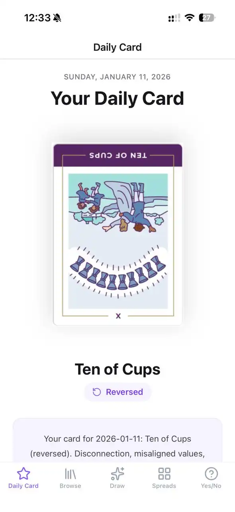
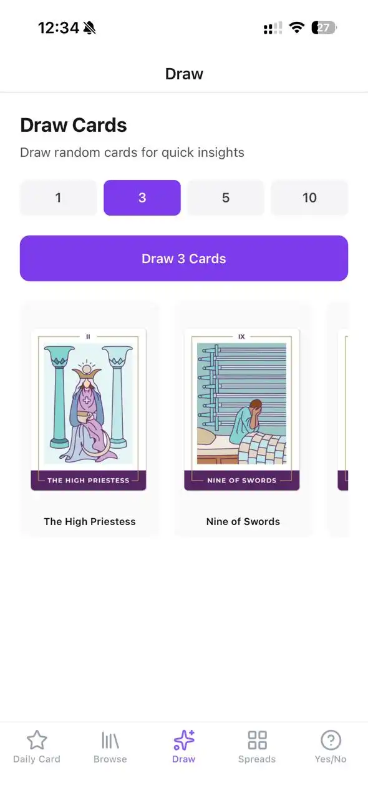
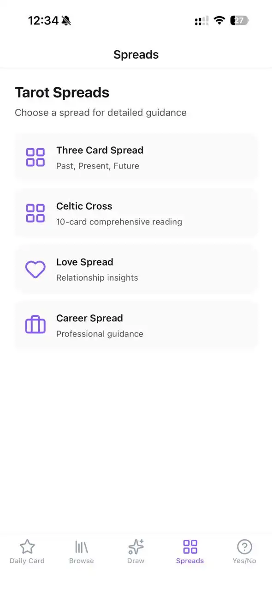
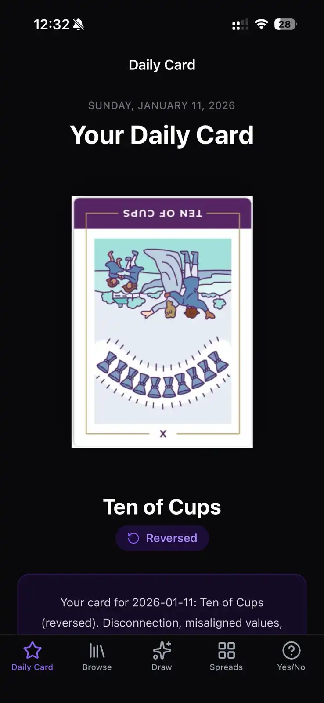
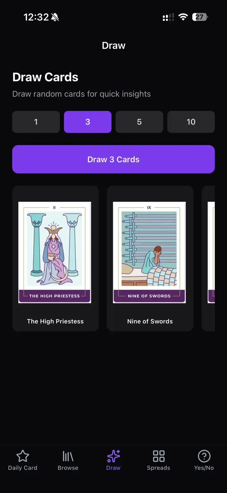
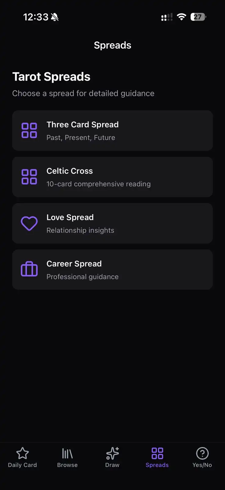

# RoxyAPI Tarot Starter

A fully functional Tarot reading app built with React Native Expo and TypeScript, powered by the RoxyAPI Tarot API. Features a complete 78-card Rider-Waite deck with daily readings, Celtic Cross spreads, yes/no divination, and more.

## Screenshots

### Light Mode
<p align="center">
  
  
  
</p>
<p align="center">
  
  
  
</p>

### Dark Mode
<p align="center">
  
  
  
</p>
<p align="center">
  
  
  
</p>

## Features

Build a professional tarot card reading app with all the essential features:

- **Daily Card Reading**: Seeded daily cards with upright/reversed meanings and beautiful card imagery
- **Browse All 78 Cards**: Filter by Major Arcana, Minor Arcana, and suits (Cups, Pentacles, Swords, Wands)
- **Quick Draw**: Draw 1-10 random cards for instant insights with position and reversal states
- **Tarot Spreads**: Three-Card (Past/Present/Future), Celtic Cross (10-card), Love Spread, Career Spread
- **Yes/No Divination**: Ask questions and receive guidance with card interpretations
- **Card Details**: Full upright and reversed meanings for every card in the deck
- **Offline Support**: User ID persisted in AsyncStorage for consistent daily readings
- **Dark Mode Ready**: Automatic light/dark mode support with violet theme

## Tech Stack

- **Expo SDK 54** - React Native development platform
- **Expo Router** - File-based navigation with bottom tabs
- **TypeScript** - Type-safe development
- **NativeWind v4** - Tailwind CSS for React Native styling
- **Axios** - HTTP client with rate limit handling
- **AsyncStorage** - Persistent user ID storage
- **Expo Image** - Optimized image loading with caching
- **Lucide Icons** - Beautiful icons for navigation
- **RoxyAPI Tarot API** - Professional tarot card data and readings
- **Auto-generated Types** - TypeScript types from OpenAPI schema

## Quick Start

### 1. Clone and Install

```bash
git clone https://github.com/RoxyAPI/tarot-starter-app
cd tarot-starter-app
npm install
```

### 2. Get Your API Key

Visit [roxyapi.com/pricing](https://roxyapi.com/pricing) to sign up and get your API key. RoxyAPI provides professional tarot data with:

- Complete 78-card Rider-Waite deck with high-quality images
- Upright and reversed meanings for every card
- Multiple spread layouts (Celtic Cross, Three-Card, Love, Career, Custom)
- Daily card readings with consistent seeding
- Yes/no divination with confidence levels
- Rate-limited API access with X-RateLimit headers

### 3. Configure Environment

Create a `.env` file in the project root:

```env
EXPO_PUBLIC_ROXYAPI_BASE_URL=https://roxyapi.com/api/v2
EXPO_PUBLIC_ROXYAPI_KEY=your_api_key_here
```

### 4. Generate Types (Optional)

Types are pre-generated from the production API. Regenerate if the API changes:

```bash
npm run generate:types
```

This fetches the latest OpenAPI spec from `https://roxyapi.com/api/v2/tarot/openapi.json` and generates TypeScript types automatically.

### 5. Run the App

```bash
# Start development server
npm start

# Run on Android
npm run android

# Run on iOS (macOS only)
npm run ios

# Run on web
npm run web
```

## API Documentation

Full API documentation available at [roxyapi.com/docs](https://roxyapi.com/docs)

### Endpoints Used

- `GET /tarot/cards` - List all 78 tarot cards
- `GET /tarot/cards/:id` - Get detailed card information
- `POST /tarot/draw` - Draw random cards with optional seed
- `POST /tarot/daily` - Get daily card reading (user-specific)
- `POST /tarot/spreads/three-card` - Past/Present/Future spread
- `POST /tarot/spreads/celtic-cross` - 10-card Celtic Cross
- `POST /tarot/spreads/love` - 5-card relationship spread
- `POST /tarot/spreads/career` - 7-card professional guidance
- `POST /tarot/spreads/custom` - Create custom spread layouts
- `POST /tarot/yes-no` - Yes/no question divination

## Project Structure

```
starters/tarot/
├── app/                          # Expo Router screens
│   ├── _layout.tsx              # Root layout with Stack
│   ├── (tabs)/                  # Tab navigation group
│   │   ├── _layout.tsx         # Bottom tabs with icons
│   │   ├── index.tsx           # Daily Card screen
│   │   ├── browse.tsx          # Browse 78 cards with filters
│   │   ├── draw.tsx            # Quick draw 1-10 cards
│   │   ├── spreads.tsx         # Spread selection list
│   │   └── yes-no.tsx          # Yes/no divination
│   └── card/
│       └── [id].tsx            # Card detail modal
├── src/
│   ├── api/
│   │   ├── schema.ts           # Auto-generated OpenAPI types (DO NOT EDIT)
│   │   ├── types.ts            # Re-exported types for convenience
│   │   ├── client.ts           # Axios instance with API key
│   │   ├── tarot.ts            # Typed API methods
│   │   └── index.ts            # Barrel export
│   └── hooks/
│       └── useUserId.ts        # AsyncStorage user ID hook
├── openapi-ts.config.ts         # OpenAPI TypeScript config
├── global.css                   # NativeWind/Tailwind CSS
├── tailwind.config.js           # Tailwind configuration
├── metro.config.js              # Metro bundler with NativeWind
├── app.config.ts                # Expo configuration
└── package.json
```

## Type Safety with OpenAPI

This starter uses **auto-generated TypeScript types** from RoxyAPI's OpenAPI specification. Types are always in sync with the production API.

**Regenerate types when API changes:**
```bash
npm run generate:types
```

This fetches the latest OpenAPI spec from production and updates `src/api/schema.ts`. See [src/api/README.md](src/api/README.md) for details.

**Benefits:**
- ✅ Types match production API exactly
- ✅ IDE autocomplete for all fields
- ✅ Compile-time validation
- ✅ No manual type updates needed

## Customization

### Change Theme Colors

This app uses **Tailwind's built-in colors** (no custom palette needed):

```typescript
// Use directly in className
className="bg-violet-600 text-zinc-900 dark:text-white"

// For React Native props (ActivityIndicator, icons), import from constants:
import { appColors } from './src/constants/colors';
<ActivityIndicator color={appColors.primary} />
```

**To change primary color:** Replace `violet-600` with any Tailwind color (e.g., `blue-600`, `purple-600`).  
**Keep it lean:** Use className for styling, constants only when required by React Native props.

### Add New Spreads

Create new spread screens in `app/(tabs)/spreads/` and add API calls in `src/api/tarot.ts`.

### Modify Card Layouts

Update components in screen files to change card display, layouts, or styling.

## SEO Keywords

tarot card reading app, React Native tarot app, Expo tarot API, tarot card app development, build tarot app, 78-card tarot deck, Celtic Cross spread app, daily tarot reading, tarot divination app, mobile tarot reader, professional tarot API, React Native card reading, Rider-Waite deck app, tarot spread layouts, yes no tarot, tarot app starter, TypeScript tarot app

## License

MIT

## Support

- API Documentation: [roxyapi.com/docs](https://roxyapi.com/docs)
- Get API Key: [roxyapi.com/pricing](https://roxyapi.com/pricing)

---

**Powered by RoxyAPI** - Professional Tarot Card API with 78-card Rider-Waite deck, multiple spread layouts, and yes/no divination
